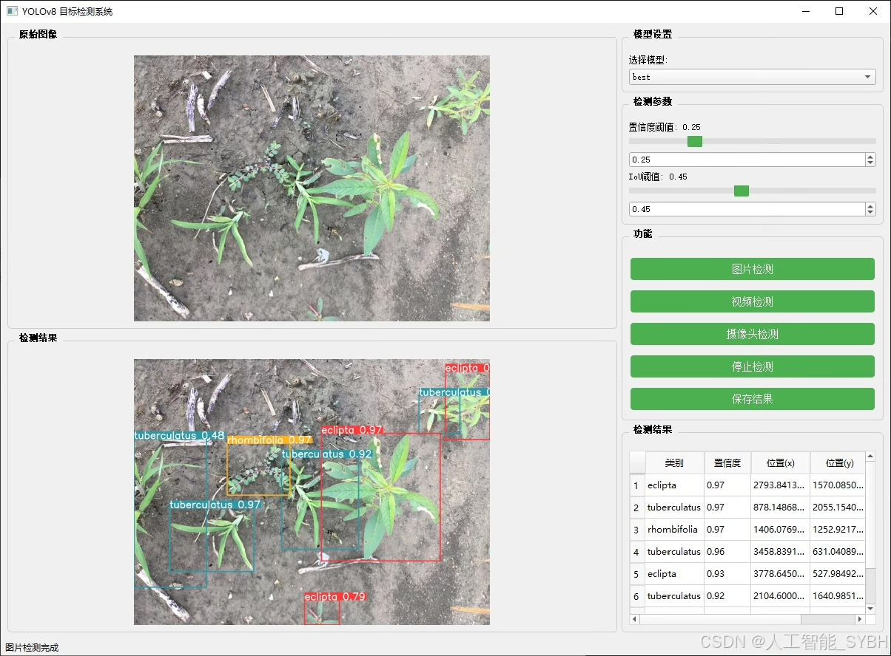
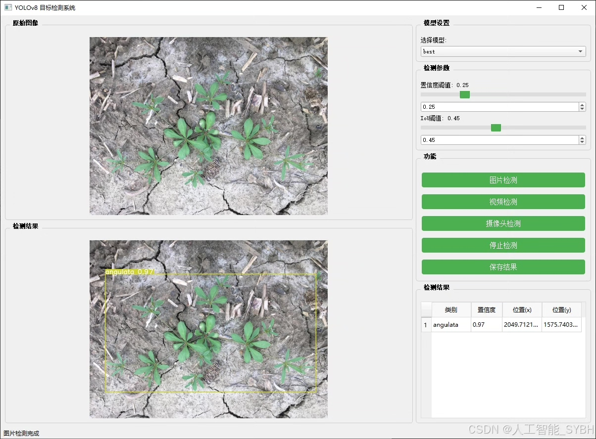
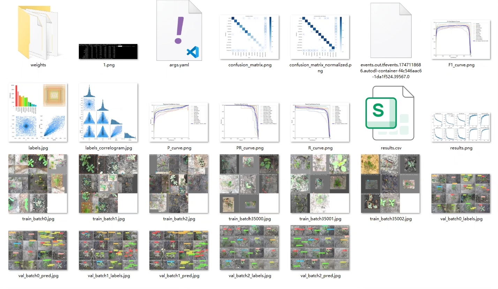
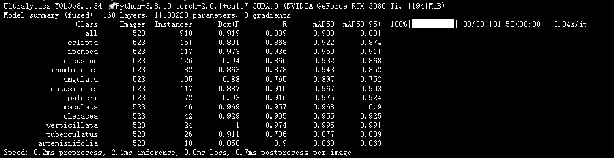
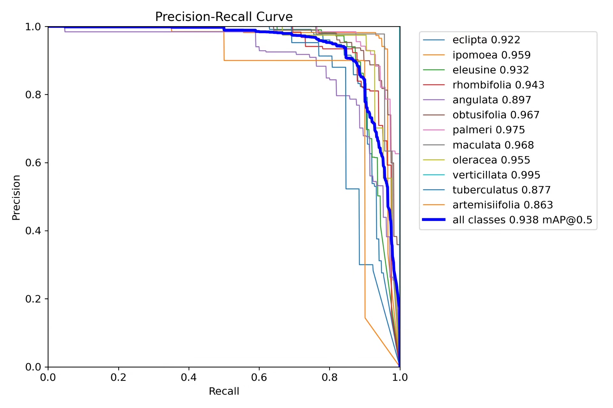
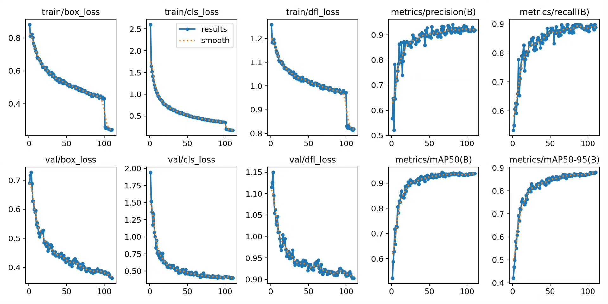
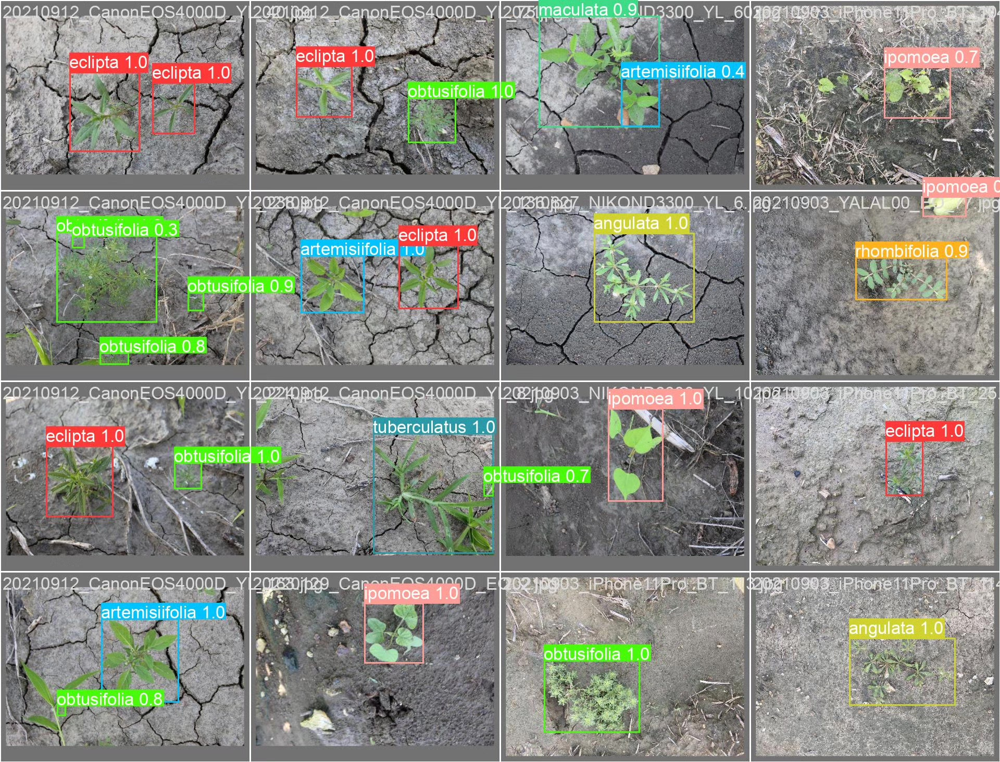

# Based on deep learning YOLOv8 for weed detection system (12 types) (YOLOv

## Body

Based on the advanced YOLOv8 object detection algorithm, this project has developed an intelligent detection system capable of recognizing 12 common weeds. The system addresses the difficulties in weed identification in the agricultural field through deep learning technology, achieving high-precision recognition of 'eclipta' (Eclipta prostrata), 'ipomoea' (Ipomoea purpurea), 'eleusine' (Eleusine indica), 'rhombifolia' (Rhombifolium teretifolium), 'angulata' (Agropyron repens), 'obtusifolia' (Oxyria digyna), 'palmeri' (Palmarum aggregatum), 'maculata' (Polygonum maculatum), 'oleracea' (Amaranthus graecizans), 'verticillata' (Verticillium albo-atrum), 'tuberculatus' (Dactylaria viscosa) and 'artemisiifolia' (Artemisia argyi) among 12 plant species. The project uses a dataset containing 3319 labeled images (2796 training images, 523 validation images), and through data augmentation and model optimization techniques, it has built an efficient and accurate weed detection model. This system can be applied in precision agriculture, intelligent weeding equipment, and农田监测, providing intelligent solutions for modern agriculture.

The company's products have obtained YOLO official commercial license certification.

We offer after-sales service.

After payment, we will provide WeChat ID to answer questions anytime.

Environmental configuration: We will provide a tutorial on environmental configuration, and WeChat provides答疑.

Remote installation service: If you need remote configuration, an additional fee of 69 is charged,
failure in configuration, all fees are refunded (specially for old computers only refund installation fees).

Retraining dataset: After setting up the environment, you can train on your own computer.
If you need us to train it, just pay 69+ computing power fees (2.5 yuan/hour).

Full after-sales service

## Images

## Payment

Here is a pay link on Stripe ( https://buy.stripe.com/3cs8yP7sY87d0vu9AB ). Please contact me lonlonago@foxmail.com after funding $89, and I will send you a complete data files , thank you!

